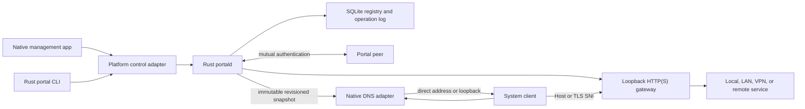

# Portal architecture

Status: architecture bootstrap, August 2026.

Portal is one portable policy and routing system with first-class native macOS
and Linux platform adapters. Cross-platform does not mean lowest-common-
denominator: each operating system supplies its own correct resolver, service,
identity, authorization, and packaging integration.

## Product boundary

Portal owns four related concerns:

1. Resolve user-controlled DNS names on enrolled devices.
2. Route HTTP and HTTPS names when the upstream scheme, address, or port differs.
3. Persist and synchronize one authoritative mapping registry per node.
4. Make certificate and trust operations explicit and inspectable.

Portal is not a browser extension, hosts-file editor, general-purpose VPN, or
promise that an upstream application will tolerate a different origin.

## System shape

## Language and platform boundary

Rust owns:

- Canonical names, mapping policy, immutable snapshots, and conflict semantics.
- Bounded DNS wire parsing and response construction.
- Registry persistence and signed operation-log replication.
- HTTP/TLS gateway protocol machinery and peer transport.
- The portable daemon, CLI command model, and Linux implementation.
- A narrow C ABI for code that must execute inside Apple-native processes.

Swift owns on macOS:

- `Portal.app` in SwiftUI/AppKit.
- The `NEDNSProxyProvider` System Extension entry point.
- System Extension activation and `SMAppService` lifecycle.
- XPC surfaces where XPC is the correct native authority boundary.
- Security.framework, Keychain, Secure Enclave, authorization, signing, and
  packaging integration.

Rust does not wrap every Apple framework merely to make the language graph look
pure. Swift does not duplicate portable resolution or routing policy merely to
make the macOS graph look native.

The interop contract is a versioned C ABI: opaque handles, caller-owned input
buffers, explicit output destruction, fixed-width values, no unwinding across
the boundary, and no Rust or Swift ABI types crossing it. The DNS extension may
embed a synchronous Rust snapshot matcher and DNS codec, but never the daemon,
database, async runtime, CA, or peer engine.

## Portable crate direction

Only `portal-core` and `portal-cli` exist in M0. Later crates are introduced at
their proof milestone, not as empty architecture theater.

| Crate | Responsibility |
|---|---|
| `portal-core` | Side-effect-free names, mappings, precedence, revisions |
| `portal-protocol` | Versioned local-control and snapshot contracts |
| `portal-dns` | Bounded DNS parsing, synthesis, and forwarding policy |
| `portal-registry` | SQLite materialization and signed operations |
| `portal-gateway` | Loopback HTTP/TLS routing and connection lifecycle |
| `portal-sync` | Peer identity, replication, conflict, and revocation |
| `portal-platform-macos` | Narrow C/Swift adapters for Apple facilities |
| `portal-platform-linux` | Resolver, service, credential, and key adapters |
| `portald` | Single authoritative host daemon |
| `portal-cli` | Stable human and machine-readable command surface |

## Mapping model

Registry keys are exact names or wildcard suffixes:

- Exact: `atlas`, `api.dev`, `google.com`
- Wildcard: `*.lab`, `*.dev.lab`

Resolution order is deterministic:

1. Exact match.
2. Wildcard with the greatest number of suffix labels.
3. Stable lexical order as a defensive tie-breaker.

Destinations are direct IP addresses, DNS aliases, or HTTP upstreams. HTTP host
behavior is explicit per mapping: preserve the client-facing host or use the
upstream host. Portal never silently rewrites bodies, redirects, cookies, CSP,
CORS, or absolute URLs.

The initial name policy accepts ASCII hostname labels and removes one terminal
DNS root dot. Unicode presentation names remain deferred until one IDNA policy
is shared by DNS, SNI, certificates, URLs, storage, and every UI.

## Authority and state

`portald` is the only writer of registry, route, peer, and certificate state.
Clients submit commands; they never edit SQLite or snapshots. SQLite in WAL
mode is the local materialized view. Accepted mutations append signed,
origin-attributed operations and advance a monotonic registry revision.

DNS and gateway readers consume complete immutable snapshots. A consumer swaps
a validated newer snapshot atomically, rejects unknown schema versions, and
keeps its last valid revision if refresh fails. Concurrent changes to the same
mapping become explicit conflicts rather than silent last-writer-wins.

## DNS integration

On macOS, a Swift `NEDNSProxyProvider` receives UDP and TCP DNS flows. A small
embedded Rust codec may validate and synthesize packets; the Swift provider owns
Network Extension lifecycle and flow APIs. Unmapped packets are forwarded with
bounded timeouts and recursion avoidance. Provider failure must not capture DNS
indefinitely.

On Linux, Portal integrates natively with the active resolver manager. The
reference systemd-resolved path directs queries through a loopback Portal DNS
listener, which answers owned names and forwards all others. NetworkManager and
non-systemd systems receive explicit adapters rather than shell-command fallbacks
hidden in the core.

## Gateway and certificates

The gateway binds `127.0.0.1` and `::1` only by default. DNS answers for routed
HTTP names point there; Host or TLS SNI selects the mapping. Streaming,
backpressure, cancellation, HTTP/1.1, HTTP/2, WebSocket, and server-sent events
are acceptance requirements.

Portal distinguishes Apple code signing, the optional local HTTPS certificate
authority, and peer node identity. These are unrelated keys and operations.
Declining CA trust is valid and leaves normal TLS errors visible.

## Proof gates

Unit tests establish policy, not platform operation. Implementation claims
require live proof of unmatched DNS forwarding, daemon restart behavior,
privileged listener supervision, browser and non-browser routing, local client
authentication, package installation, update, rollback, and complete removal.

